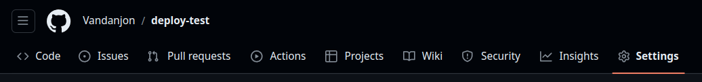
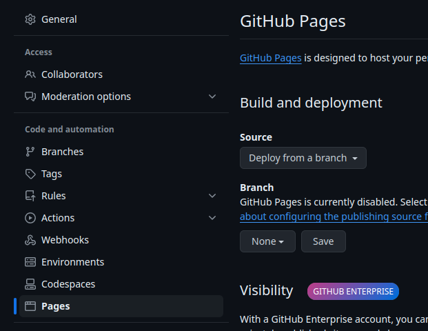
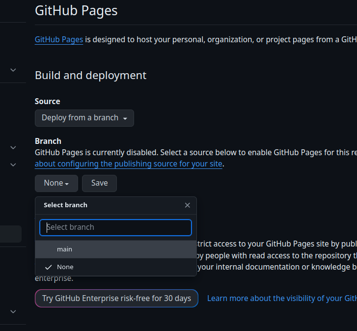
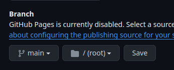
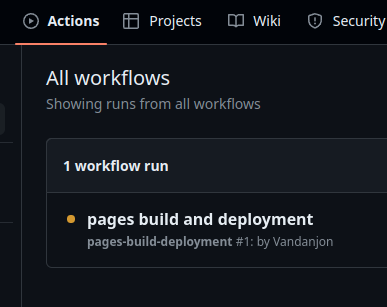
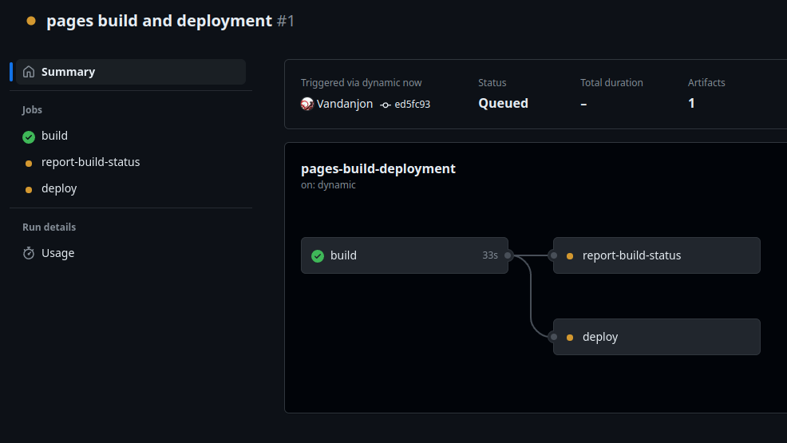
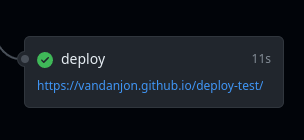
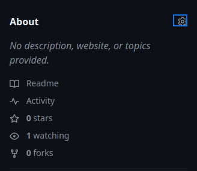
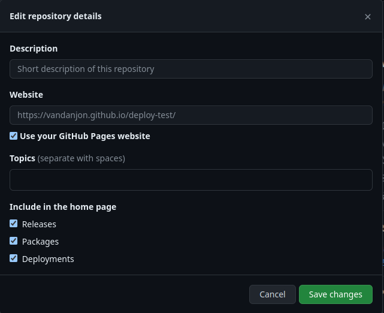

# Déployer des fichiers classiques avec GitHub Pages

Pourquoi GitHub Pages ? Et bien les hébergements de qualité sont souvent payants. GitHub Pages propose un service correct gratuitement.
{:.alert-info}

## Que veut dire "déployer" ?

Le travail des développeurs est de construire des systèmes de fichiers qui intéragissent ensemble pour former de sites.
Pendant la phase de développement, ils testent leurs fichiers sur un serveur simplifié sur leur ordinateur personnel : le localhost.

Mais dans la vraie vie, il faut que tout le monde puisse utiliser leurs fichiers. Il faut alors les mettre sur un serveur accessible par tout le monde. On peut y accéder via une URL (un nom de domaine).

## Tenter de déployer un site par vous-même

Le fastidieux travail de rendre fonctionnel des serveurs dans le monde entier est délégué aux DevOps. Alors changeons de casquette et allons voir l'envers du décor.

### Préparation

Pré-requis : [Git/GitHub 1](https://odyssey.wildcodeschool.com/quests/2133)
{: .alert-info}

Créer un repo sur GitHub. Vous pouvez le laisser public ou privé.

Le lien pour accéder au déploiement, lui, sera public (en même temps, à quoi ça servirait sinon ?).

### Le déploiement proprement dit

- Aller sur l'onglet des `Settings`

- Dans la catégorie `Code and automation` à gauche, choisir `Pages`

- Choisir la branche sur laquelle lancer le déploiement automatique (le plus souvent : `main`) et valider.

### Et la magie opéra

GitHub va maintenant lancer toute une série d'actions pour construire un site avec les fichiers qu'il trouvera sur votre repo. Il suffit d'aller sur l'onglet `Actions` pour le voir.

Si on veut observer les actions en détails, il suffit de cliquer sur le processus en cours.

À la fin du processus automatique de déploiement, GitHub Pages génère un lien depuis lequel votre site sera accessible.

## Pour aller plus loin

Pour simplifier la vie de tout le monde, vous pouvez personnaliser la section `About` de votre repo (vers la droite de la page).

En cochant simplement la case `Use your GitHub Pages website`, le champ `Website` se remplira automatiquement. Elle est pas belle la vie ?

Le plus intéressant, c'est qu'à chaque fois que vous ferez un **push** sur la branche connectée à ce déploiement (`main` dans notre cas), le site se mettra automatiquement à jour. Merci les DevOps ❤️.
