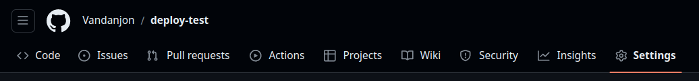
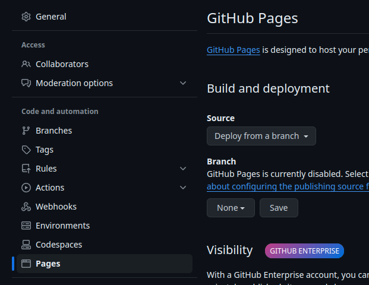
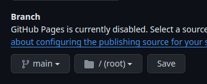

# Deploying vanilla files with GitHub Pages

[⬅ English version](./)

Why GitHub Pages? Well, quality hosting is often not free. GitHub Pages offers a decent service free of charge.
{:.alert-info}

## What does "deploy" mean?

Developers job is to write file systems that interact with each other to build sites.
During the development phase, they test their files on a simplified server on their home computer: the localhost.

But in real life, they need to make sure that everyone can use their files. This means putting them on a server that everyone can access. This can be accessed via a URL (a domain name).

## Attempting to deploy a site yourself

The tedious job of getting servers up and running all over the world has been delegated to DevOps. So let's change hats and take a look behind the scenes.

### Preparation

Prerequisites : [Git/GitHub 1](https://odyssey.wildcodeschool.com/quests/2133)
{: .alert-info}

Create a repo on GitHub. You can leave it public or private.

The link to access the deployment will be public (but what's the point?).

### The deployment itself

- Go to `Settings` tab

- In the `Code and automation` category on the left, choose `Pages`.

- Select the branch on which to launch automatic deployment (usually `main`) and validate.

### And the magic happened

GitHub will now launch a whole series of actions to build a site with the files it finds on your repo. Just go to the `Actions` tab to see it.

If you want to observe the actions in details, simply click on the current process.

At the end of the automatic deployment process, GitHub Pages generates a link from which your site can be accessed.

## To go further

To make life easier for everyone, you can customize the `About` section of your repo (on the right-hand side of the page).

Simply tick the `Use your GitHub Pages website` box, and the `Website` field will fill in automatically. Ain't life grand?

What's even more interesting is that every time you perform a **push** on the branch connected to this deployment (`main` in our case), the site will automatically update itself. Thanks DevOps ❤️.
